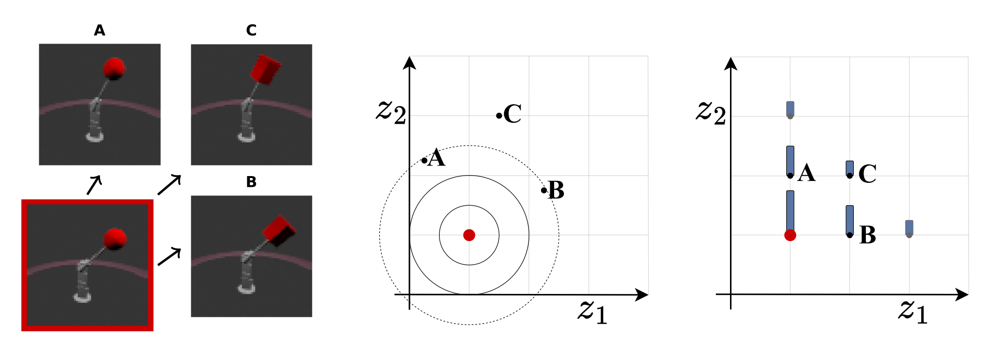

# lddr
This repository contains the JAX + Haiku implementation for the **ECML PKDD 2023** submission [*Learning Disentangled Discrete Representations*](https://arxiv.org/abs/2307.14151).

## Learning Disentangled Discrete Representations

With this paper, we explore the relationship between discrete latent spaces and disentangled representations, which offer interpretability, fairness, and better sample complexity for learning. By replacing the standard Gaussian variational autoencoder (VAE) with a tailored categorical variational autoencoder, we investigate the impact on disentanglement. We show that the underlying grid structure of categorical distributions mitigates the problem of rotational invariance associated with multivariate Gaussian distributions, acting as an efficient inductive prior for disentangled representations.

|  |
|:---|
| Figure 1: Four observations and their latent representation with a Gaussian and discrete VAE. Both VAEs encourage similar inputs to be placed close to each other in latent space. **Left:** Four examples from the MPI3D dataset. The horizontal axis depicts the object's shape, and the vertical axis depicts the angle of the arm. **Middle:** A 2-dimensional latent space of a Gaussian VAE representing the four examples. Distances in the Gaussian latent space are related to the Euclidean distance. **Right:** A categorical latent space augmented with an order of the categories representing the same examples. The grid structure of the discrete latent space makes it more robust against rotations constituting a stronger inductive prior for disentanglement.|

We focus on the impact on disentanglement of replacing the standard variational autoencoder with a slightly tailored *categorical* variational autoencoder. Conventional categorical variational autoencoders lack sortability since there is generally no order between the categories. In order to enable a direct comparison through the established disentanglement metrics, we modify the categorical variational autoencoder to represent each category with a *one-dimensional* representation to inherit the canonical order of the real numbers. While regularization and supervision have been discussed extensively in the disentanglement literature, the variational autoencoder is a component that has mainly remained constant. At the same time, multivariate Gaussian distributions suffer from rotational invariance, which can harm disentangling properties. We show that the underlying grid structure of categorical distributions mitigates this problem and acts as an efficient inductive prior for disentangled representations.

## Code

#### Requirements
* python==3.9
* cudnn==8.2
* pytorch==1.13
* jax==0.4.8
* dm-haiku==0.0.10
* optax==0.1.4
* scikit-learn-1.2.2
* python-box==7.0.1
* einops==0.6.0
* six==1.16.0


#### Data
Please [download](https://github.com/google-research/disentanglement_lib#downloading-the-data-sets) the datasets as described in the [disentanglement_lib](https://github.com/google-research/disentanglement_lib) repository.
The model utilizes the `DISENTANGLEMENT_LIB_DATA` environment variable to find the datasets.
We experimented with following datasets:
```
dsprites_full
color_dsprites
smallnorb
cars3d
shapes3d
mpi3d_toy
```

#### Training the model
```
python run.py --dataset mpi3d_toy --gaussian --tc --gamma 30 --seed 42 --save_path ./
```
 `--dataset` specifies the dataset to use \
 `--gaussian` toggles between Gaussian (enabled) and discrete (disabled) latent spaces \
 `--tc`  enables or disables regularization of total correlation \
 `--gamma` sets the gamma value for regularization when --tc is enabled \
 `--seed` defines the random seed \
 `--save_path` specifies the path to save the checkpoints


 #### Evaluating the model
 ```
 python eval.py --save_file ./mpi3d_toy_factor30.0.pkl
 ```
 `--save_file` indicates the model file to load and evaluate


# Citation
```bibtex
tba
```

# License
[MIT](LICENSE)